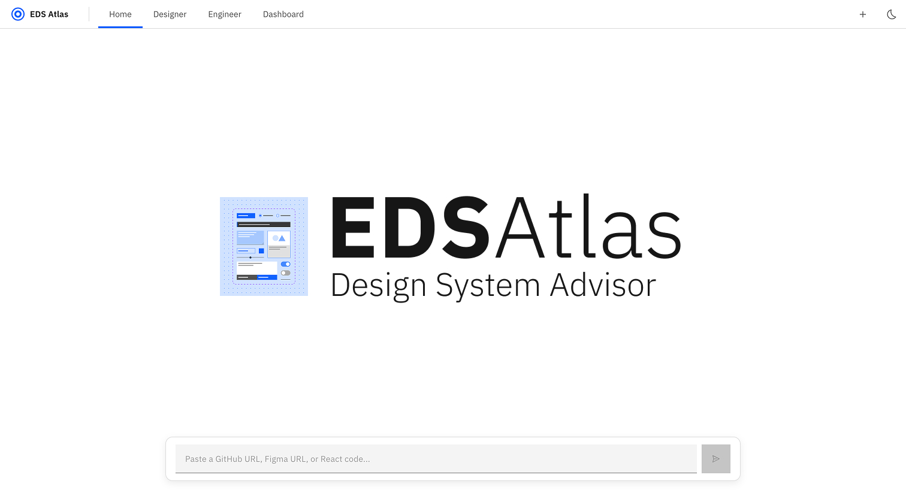

# EDS Atlas - AI-Powered Design System Code Inspector

<p align="center">
  
  
  
  
</p>

EDS Atlas is an AI-powered tool that analyzes GitHub repositories and Figma designs for IBM Carbon Design System compliance. It provides interactive fixes, visual comparisons, and compliance metrics.

## Features

- **Repository Analysis**: Analyze entire GitHub repos for Carbon compliance
- **Figma Analysis**: Check Figma designs against Carbon tokens
- **Design-Code Drift Detection**: Compare Figma designs to code implementations
- **Interactive Fixes**: Apply suggested fixes with before/after previews
- **Live Code Preview**: See violations highlighted in live-rendered components
- **Compliance Dashboard**: Track compliance trends over time
- **Designer & Engineer Views**: Tailored interfaces for different roles

## Tech Stack

| Layer | Technology |
|-------|------------|
| Frontend | Next.js 14, React 18, Tailwind CSS, Carbon Design System |
| Backend | Node.js, Express |
| Database | SQLite (better-sqlite3) |
| AI | Claude API (Anthropic) |
| APIs | GitHub API, Figma API |

## Quick Start

### Prerequisites

- Node.js 18+
- npm or yarn
- (Optional) API keys for full functionality:
  - Anthropic API key
  - GitHub token
  - Figma access token

### Installation

```bash
# Clone the repository
git clone <repo-url>
cd eds-ai-agent

# Install backend dependencies
cd backend
npm install
cp .env.example .env
# Edit .env with your API keys

# Install frontend dependencies
cd ../frontend
npm install
```

### Running the Application

```bash
# Terminal 1: Start backend (port 3001)
cd backend
npm run dev

# Terminal 2: Start frontend (port 3000)
cd frontend
npm run dev
```

Open http://localhost:3000 in your browser.

### Demo Mode

The application works without API keys using mock data. Toggle "Mock Data" in the UI to use demo mode.

## Configuration

Create `/backend/.env` with:

```env
ANTHROPIC_API_KEY=sk-ant-...      # For AI analysis
GITHUB_TOKEN=ghp_...               # For repo cloning
FIGMA_ACCESS_TOKEN=figd_...        # For Figma integration
PORT=3001
DATABASE_PATH=./database/database.sqlite
```

## Usage

### Chat Interface (Home)

1. Paste a **GitHub URL** to analyze a repository
2. Paste a **Figma URL** to analyze a design
3. Paste **React code** directly for quick analysis

### Designer View

- Visual-only interface for designers
- No code knowledge required
- Color/spacing/typography comparisons
- Figma-specific fix instructions

### Engineer View

- Monaco code editor with violation highlighting
- Live React preview with react-live
- Before/after code comparisons
- One-click fix application

### Dashboard

- Compliance score trends
- Violation breakdown charts
- Top violating files
- PR review history

## API Endpoints

| Method | Endpoint | Description |
|--------|----------|-------------|
| POST | `/api/analyze/repo` | Start repository analysis |
| GET | `/api/analyze/status/:id` | Get analysis status |
| GET | `/api/analyze/results/:id` | Get analysis results |
| POST | `/api/analyze/file` | Analyze single file |
| POST | `/api/figma/analyze` | Analyze Figma design |
| POST | `/api/figma/compare` | Detect design-code drift |
| GET | `/api/metrics/:repoId` | Get compliance metrics |
| GET | `/api/health` | Health check |

## Project Structure

```
eds-ai-agent/
├── frontend/                 # Next.js 14 app
│   ├── app/
│   │   ├── components/      # React components
│   │   ├── designer/        # Designer view page
│   │   ├── engineer/        # Engineer view page
│   │   ├── dashboard/       # Dashboard page
│   │   └── page.jsx         # Home page
│   └── lib/                 # API client, mock data
├── backend/                  # Express server
│   ├── services/            # Business logic
│   ├── routes/              # API routes
│   ├── database/            # SQLite setup
│   └── data/                # Carbon tokens/components
└── demo-repo/               # Sample repo with violations
```

## Carbon Design System Checks

EDS Atlas checks for:

- **Hardcoded Colors**: Should use Carbon color tokens
- **Hardcoded Spacing**: Should use Carbon spacing scale
- **Custom Components**: Should use Carbon equivalents
- **Typography**: Should use Carbon type tokens
- **Accessibility**: Contrast, labels, ARIA attributes
- **Inline Styles**: Should use Carbon styling patterns

## Contributing

1. Fork the repository
2. Create a feature branch
3. Make your changes
4. Submit a pull request

## License

MIT License - see LICENSE file for details.

## Resources

- [Carbon Design System](https://carbondesignsystem.com/)
- [Carbon React](https://react.carbondesignsystem.com/)
- [Anthropic Claude API](https://docs.anthropic.com/)
- [Next.js Documentation](https://nextjs.org/docs)
